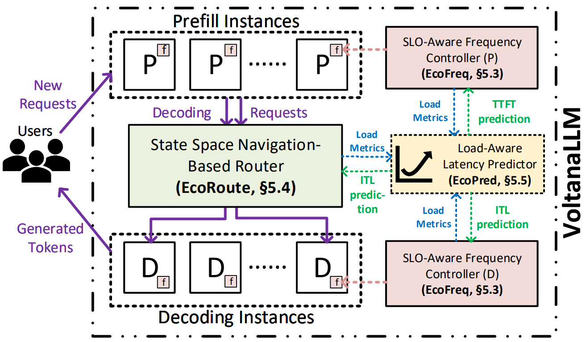
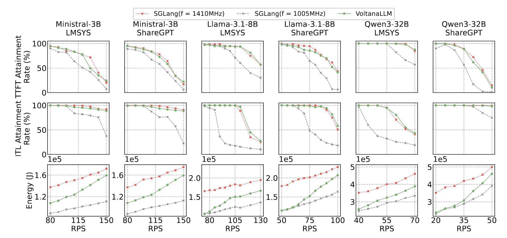

# VoltanaLLM: Feedback-Driven Frequency Control and State-Space Routing for Energy-Efficient LLM Serving

<p align="center">
  <a href="https://arxiv.org/abs/2509.04827"></a>
  <a href="https://supercomputing-system-ai-lab.github.io/blogs/blog/voltanallm/"></a>
</p>

## News

- 2025-09-13: VoltanaLLM's code (v0.1) has been released.

## About

VoltanaLLM is a system for SLO-aware, energy-efficient LLM serving, built from a control theory perspective.
It co-designs **frequency scaling** and **request routing** in **P/D disaggregated** architectures, leveraging their decoupled execution to enable fine-grained phase-specific control.
Our evaluation shows it can achieve up to **36.3%** energy reduce compared to static max-frequency baseline.

VoltanaLLM is built on top of [SGLang v0.4.7.post1](https://github.com/sgl-project/sglang/tree/v0.4.7.post1).

## Features

VoltanaLLM has the following key capabilities:

- **Energy Efficiency**: It adaptively lowers GPU frequency to significantly reduce energy consumption during LLM inference.
- **SLO-aware Control**: Frequency scaling is SLO-aware so it will not compromise service quality. Users can make custom trade-offs between energy and latency by setting appropriate SLOs.
- **Phase-Specific Optimization**: It applies independent frequency control for prefill and decode phases, which is critical for handling real-world workload variations. It also enables users to set their custom phase-specific SLOs.
- **Lightweight Latency Prediction**: It uses a simple yet accurate and explainable linear regression model to predict latency (TTFT/ITL) in real-time, enabling fast and reliable control decisions.

To achieve these capabilities, VoltanaLLM has three key designs:

- **EcoFreq**: A feedback-based frequency controller that performs frequency scaling in a lightweight, phase-specific, and fine-grained (per-iteration) manner, to maximize energy efficiency while preserving SLO attainment.
- **EcoRoute**: A router specifically designed for prefill-to-decode request routing. It mitigates boundary-induced energy inefficiency by analyzing and navigating in the state spaces of decode instances.
- **EcoPred**: A lightweight yet accurate TTFT/ITL predictor. It utilizes collected profiling data and interpretable linear regression to estimate latencies.



## Quick Start

### Setup Environment

Create conda environment:

```shell
conda create -n voltanallm python=3.12 nvidia/label/cuda-12.8.1::cuda-toolkit -y
conda activate voltanallm
```

Build and install VoltanaLLM:

```shell
export MAX_JOBS=$(nproc)
pip install -v -e "python[all]"
```

Install Flashinfer following the [instruction](https://docs.flashinfer.ai/installation.html).

Install UCX and NIXL for P/D disaggregation:

```shell
## install UCX

# make sure $CUDA_HOME is the directory of your CUDA toolkits
# if you install cuda-toolkits by conda, you can set $CUDA_HOME as $CONDA_PREFIX
# make a directory to install UCX, denote it as <PATH_TO_UCX>

wget https://github.com/openucx/ucx/releases/download/v1.18.0/ucx-1.18.0.tar.gz
tar xzf ucx-1.18.0.tar.gz
cd ucx-1.18.0
./configure                          \
  --enable-shared                    \
  --disable-static                   \
  --disable-doxygen-doc              \
  --enable-optimizations             \
  --enable-cma                       \
  --enable-devel-headers             \
  --with-cuda=$CUDA_HOME             \
  --with-verbs                       \
  --with-dm                          \
  --enable-mt                        \
  --with-go=no                       \
  --prefix=<PATH_TO_UCX>
make -j
make -j install-strip


## install NIXL

git clone https://github.com/ai-dynamo/nixl.git
cd nixl
git checkout 0.3.0

# edit meson_options.txt, change this line:
# option('gds_path', type: 'string', value: '<CUDA_HOME>/targets/x86_64-linux/', description: 'Path to GDS CuFile install')

pip install . --config-settings=setup-args="-Ducx_path=<PATH_TO_UCX>"
```

Now you can run VoltanaLLM!

### Simple Demo

Check [voltana-llm-scripts/demo/README.md](voltana-llm-scripts/demo/README.md) to run a simple demo.

### Build Latency Prediction Model

Check [voltana-llm-scripts/predictions/README.md](voltana-llm-scripts/predictions/README.md) to build the latency prediction model on your own GPUs.

<!-- ### Reproduce Paper Results

Check [voltana-llm-scripts/evaluations/README.md](voltana-llm-scripts/evaluations/README.md) to reproduce results in our paper. -->

## Evaluation

We evaluate VoltanaLLM across different models (`Ministral-3b-instruct`/`Llama-3.1-8B-Instruct`/`Qwen3-32B`) and different datasets (ShareGPT and LMSYS-CHat-1M).
The testbed is 4xA100-80G SXM4, with 2-prefill-2-decode (2P2D) system configuration.
VoltanaLLM shows:

- Energy savings: Up to **36.3%** vs. static max-frequency baseline.
- SLO attainment: **Comparable** to always running at 1410 MHz (max-frequency).
- Workload robustness: Benefits held across request rates, workloads, and SLO profiles.



## Citation

```biblatex
@misc{yu2025voltanallmfeedbackdrivenfrequencycontrol,
      title={VoltanaLLM: Feedback-Driven Frequency Control and State-Space Routing for Energy-Efficient LLM Serving},
      author={Jiahuan Yu and Aryan Taneja and Junfeng Lin and Minjia Zhang},
      year={2025},
      eprint={2509.04827},
      archivePrefix={arXiv},
      primaryClass={cs.DC},
      url={https://arxiv.org/abs/2509.04827},
}
```
